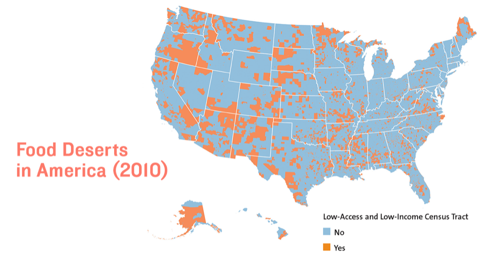
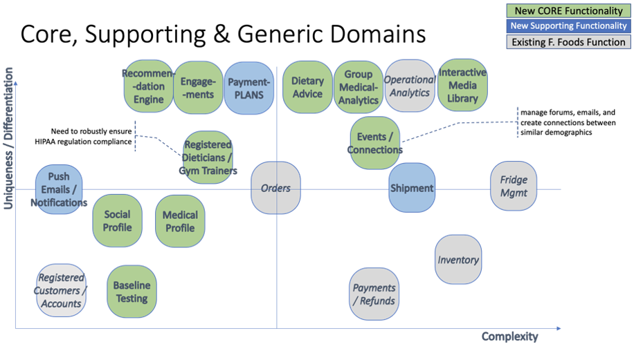
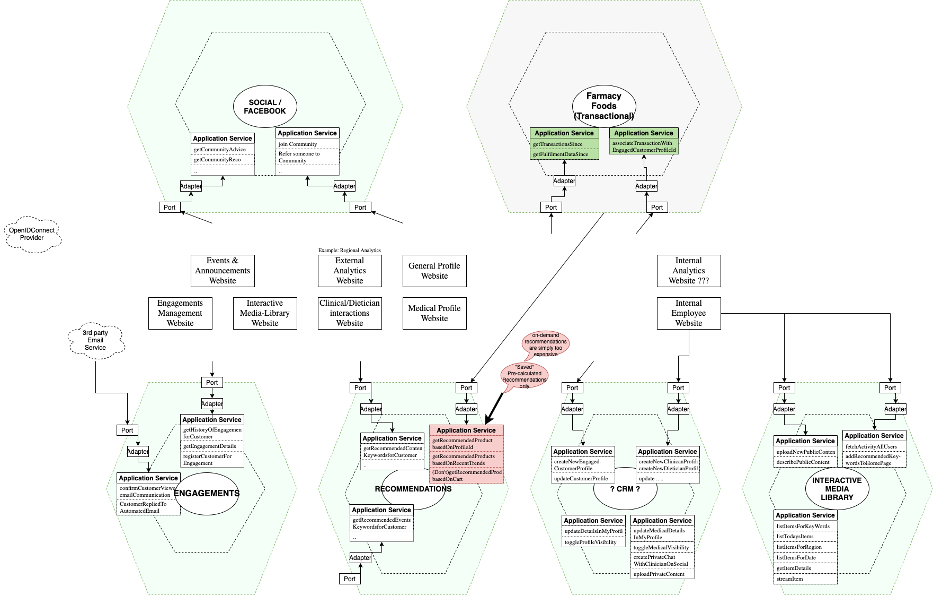
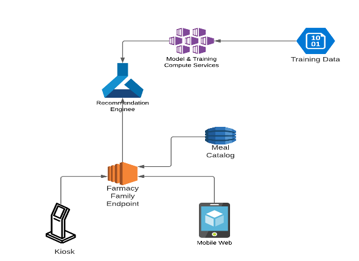

# Architectural Katas 2020 Fall – Architects++

# 1.Introduction

We are called Architects++ since we are a group from Cognizant of architects aided by a product manaager. 

The team includes the following people:

- Udaybhaskar Seetamraju (architect)
- Rakesh Rai (architect)
- Chris Butler (product manager)

While we were not able to complete the project due to conflicting time (and client) requirements we are very excited to provide this background and thoughts so far. 

# 2.Background

## 2.1.Overall strategy

Turn [food deserts](https://www.aecf.org/blog/exploring-americas-food-deserts) into fresh and healthy food oases for everyone. Everyone feels like they are part of a community that helps them make the right choices for their circumstance.

## 2.2.The problem

Food deserts are an issue that effects 39.5 million people (or 12.8% of the population) in the United States.

The top reason why there are food deserts is the overabundance of &quot;convenience food&quot; rather than healthy food. From the report:

Low-income families are more likely to live in communities populated by smaller corner stores, convenience markets and fast-food vendors with limited healthy food options.

Farmacy Food is working to solve this key problem around food deserts in many places around the US. However, they have found that due to the extremely transactional nature of their current model people are not converting to long term customers, engaging with other customers of the same community, and getting recommendations based on medical need.

## 2.3.Vision

Imagine a future where people can get heavily subsidized or free food where they go to take care of other errands. In low-income neighborhoods this could be your local health clinic, school, food bank/pantry, library, senior centers, and subsidized housing.

People can easily swipe identification or payment (including food assistance programs like SNAP and food stamps) to get access to fresh, healthy, and diet-appropriate foods when they are hungry.

Neighborhoods originally identified as in a food desert are now in food oases because of Farmacy Food&#39;s distribution.

Members of dietary communities that are underrepresented do not feel alone. They know where to go to get exactly the food they want and what is most important to live fulfilling and healthy lives.

## 2.4.Goals

From the original description of the kata, we pulled the following goals:

- Develop relationships between engaged customers and nurture those relationships.
- Convert transactional customers to engaged customers.
- Generate analytical data from medical information to demonstrate the benefits of Farmacy Foods.
- Connect, gather, analyze, and communicate.

We would add the following goals that are the reasons for community driven features:

- Empower customers to improve their diets
- Meet people where they are and where they go regularly to get other services

## 2.5.Principles

Poised as &#39;this over that&#39; since we will want to prioritize certain aspects but must always consider if we need to make a different decision.

Here are the key principles we are using to make decisions:

1. **Partnership over &quot;rolling our own&quot;** – we will try to utilize other group&#39;s work rather than making sure it is built from scratch on our own to save on resources
2. **Seamlessness over silos** – we want to preset Farmacy Foods/Family as a single entity rather than different groups
3. **Direct connections between people over intermediation by experts** – we want to prioritize the community of &quot;people like me&quot; to give advice rather than prioritizing professionals but will attempt to mix both

Others we are missing?

## 2.6.Personas

In the original kata documentation, there is a discussion of different personas that

- Low-income families
- Elderly
- First responders
- Dietitian, clinicians, and other medical professionals – not included in the kata personas but referenced later

Are there others we should consider extending this to?

## 2.7.Partners

There are two types of partners we are considering for Farmacy Family: 1) platforms for functionality and 2) locations where our customers will be.

### Platform partners

As part of the functionality (and reference to one of our principles) we will not plan on building everything from scratch. We will try to use any partner&#39;s services for platforms like discussions, event management, and more.

### Location partners

Our main customers/personas will interact with a lot of different physical locations to get services that we will use as places for our food fridges. This will include the following:

- Free and low-cost community medical clinics
- Food banks and pantries
- Senior centers and homes
- Schools
- Libraries
- Affordable housing
- TBD

Location partners will have a special interface for helping people sign up if they are not able to themselves.

## 2.8.Experiences

Some of these experiences are already covered by Family Foods and will be extended by Farmacy Family:

- Get food – when people are out, they can get the right food for their needs.
- Restock food – Farmacy Food employees can restock the right food and avoid any waste.

The following new experiences will be supported by Farmacy Family:

- Join community – after purchasing food people can join the community to get further advice.
  - A sub-experience will be for location partners to sign other people if they need help.
- Get community advice – people get advice on specifics of eating that is right for their needs. This could be to a specific question or general research on a topic.
- Get recommendations – based on their usage we will update their profiles to get recommendations for content and food.
- Give community advice – people can provide advice to people with similar needs.
- Get professional advice – doctors, dietitians, and nutritionists can provide advice to people so they get the right food for their needs.
- Give professional advice – practitioners can give specific advice to individuals that they are currently treating (in accordance with HIPAA).
- Schedule events/classes – organizers can create events and classes either online or in person.
- Attend events/classes - members of the community can join scheduled events and classes.

There are multiple channels we plan on making this content available (or not available):

- Desktop web – for both community members and practitioners
- Mobile web
- Email and SMS – notifications
- ~~Mobile apps~~ - see below

On-boarding with Farmacy Family will take place across multiple channels:

- Farmacy Foods and Family site desktop/mobile website
- Email receipt from purchase of food – links to Farmacy Family website
- QR codes – on locations, flyers, and vending machines that redirect to sign up on the Farmacy Family website

# 3.Key Architecture considerations

## 3.1.Architecture Principles

We will be referring to the following:

[https://docs.microsoft.com/en-us/dotnet/architecture/modern-web-apps-azure/architectural-principles](https://docs.microsoft.com/en-us/dotnet/architecture/modern-web-apps-azure/architectural-principles)

[https://pubs.opengroup.org/architecture/togaf8-doc/arch/chap29.html](https://pubs.opengroup.org/architecture/togaf8-doc/arch/chap29.html)

Augmented by: [https://docs.aws.amazon.com/wellarchitected/latest/framework/oe-design-principles.html](https://docs.aws.amazon.com/wellarchitected/latest/framework/oe-design-principles.html)

## 3.2.General

- &quot;Support Community&quot;
  - Support physical gatherings
  - Enable virtual gatherings
  - Different clusters of customers frequently consolidate around similar dietary requirements

## 3.3.Data Resilience

- Orders and Fulfilment are already addressed in previous Kata.
- If social connection history is lost, there&#39;s potential to lose a customer not seeing the value-benefit, but an engaged customer will attempt to re-connect/re-engage
- If purchase, engagement, or preference information is lost, the recommendation-engine&#39;s recommendations will be of lower quality but not fatal.
- That said, all &quot;disks/EBS&quot; and data-stores (for Videos, PDFs) should be replicated to another zone on a quarterly basis (to avoid significant network + replication charges)

## 3.4.Availability

- Expectation that social media has top-notch availability.
- Expectation that website has top-notch availability.
- Email and Text communication can be delayed by up to a day, as no time-sensitive communications noted in requirements.
- Recommendation-engine is utiliized in &quot;batch&quot; mode, and not in live-response mode.

## 3.5.Performance

- Total # of Users: 100s currently
  - Separated by distinct geographic zones
- Approximate peak traffic:
  - 100s at 6pm daily.
- Social-media and website needs to be highly responsive performance-wise.
 These two should demonstrate elasticity for any peak loads (these peak-loads should be very much predictable:- given that the human need for food has a daily-schedule, as well as traffic due to pre-communicated events/engagements)
- None of the other functionalities/capabilities require high performance nor real-time behavior

## 3.6.AI/ML &amp; Data Management

- No Data Curation needed
- No Data preparation needed
- No data-integrity requirements noted: there are no &quot;Critical&quot; relationships between the various data (whether chat, engagement history, order history, medical communications, recommendations, etc..)
- Recommendation-engine is utiliized in &quot;batch&quot; mode, and not in live-response mode. AI/ML is expensive, so low-cost approaches should be chosen to implement the recommendation models and associated learning.
- No IoT data streams expected from Fridges or other sources (to feed recommendation-engine);
 Alternatively, such IoT data streams do Not contain data useful for recommendation-engine
- No current plans to offer &quot;AI-driven voice mode interactions&quot;, given our assumptions on the mobile devices used by customer base.

## 3.7.Workflows &amp; &quot;common feature set&quot;

- Any workflows would be internal (regarding tracking conversion of a transactional customer to an engaged customer)
- Medical conversations are just that (a.k.a. History), Not workflows.
- No &quot;live customer service&quot; features requirement noted (yet)

## 3.8.Regulatory

See ADR #1 titled &quot;HIPAA specific isolation&quot; for full analysis and considerations.

## 3.9.Security Considerations

- HIPAA
- Not be in the news
- Avoid sophisticated access-control mechanisms at all costs.
- Number of use-cases that have access-implications / changes should be \&lt; 5 (ideally) - to ensure end-users (customers) do not make mistakes.

## Security Design aspects (decisions)

- User experience single-handedly drives the Authentication model.
 Plain use of OpenIDConnect only, with just email-address &amp; Full name as the information revealed by OIDC Provider.
- Whether or not HIPAA compliance is implemented technically and operationally maintained, it will be a public disaster if one customer&#39;s medical and personal details are inadvertently leaked to another (or to a hacker);
 So, access controls should be based on a simple model for Roles, with 4 clean Roles – either an Engaged-Customer, a Transactional-Customer(No login), a Clinician/Dietician/Gymster.. and Finally, the internal-employee Role.
  - Internal users will have chicken-n-egg challenge: the ability to mark themselves as internal-user (a &quot;standard&quot; problem typically seen with &quot;Admin&quot; roles)
  - Internal users are the only ones capable of onboarding someone as a Clinician/Dietician/Gym role.
 For initial rollout, there is no &quot;self-service&quot; UI for anyone to register themselves as Clinician/Dietician/Gymster. Too many security vulnerabilities if such a feature was to be ever implemented.
- Access Control Lists should be associated with all Medical artifacts/uploads and all Medical chats with Clinicians/Dieticians.
  - Based on previous bullet, this ACL should have following SIMPLE model:
    - Model 1: HIPAA-ACL
      - Who&#39;s the Engaged-Customer (single, and cannot be changed/updated)
      - Who&#39;s the Clinician/Dietician/Gymster (single. Can initially be NULL and cannot be changed/updated once set)
      - What are the Date time stamps, etc.. (read-only as per best practice)
    - Model 2: Engagement groups
      - An owner: Who can be anyone with any one of the 4 roles.
      - A simple list of Engaged-Customers.
      - This list can be updated by the owner only
  - ACLs are automatically created by the solution - most of the time WITHOUT the Clinician/Dietician association.
 Solution should allow Customer to initiate engagement with a Clinician/Dietician, at which point, a new ACL is created that will contain the Clinician/Dietician information.
- Requirement: Farmacy Family customers can customize how much profile information they want to allow the community to see, at a fine- grained level;
  - This will be implemented using a UI that is almost identical to what&#39;s well-known within social media.
  - If not / otherwise, we will only offer a single &quot;toggle-button&quot; -- to hide/show Medical-information (distinguishing it from non-medical profile information).
- All data flows between Farmacy Foods and Farmacy Family should be based on IP-Allowed lists only (which is expected to be uni-directional, for feeding the Recommendation-engine)
- Recommendation-Engine is most effective, if data is Not masked.
 This is being allowed, only as long as the information that is in the recommendation (a.k.a. any output of recommendation-engine) has no personal or HIPAA governed information.
  - This recommendation engine should be well hidden from any mode of access.
  - Farmacy Foods and Family is not in a position to enable connectivity like AWS Direct Connect. Based on need, AWS VPN will be considered if &quot;some kind of direct access&quot; to recommendation engine environment is needed for developers.

# 4.Summary View of Solution Domains

The domains marked as &quot;Green&quot; indicating new solution-components to be developed.

Detailed view of the above, in a Hexagonal Architecture is available as an readable-attachment.

A thumbnail of the larger diagram is below.

# 6.Architecture Decision Records

## 6.1.HIPAA specific isolation

### Status

Draft

### Context

Key question to answer: can we separate out the specifics w.r.t.HIPAA (as isolated solution components) to avoid making the entire solution HIPAA compliant?

- Firstly, to demonstrate due-diligence on an important topic, we&#39;d like to point out that even for smaller operation like Farmacy Family, we initially considered the suitable **option of using a FULLY HOSTED solution** (like _Kustomer.com_)
  - The enormous benefit of this hosted-option is that the current folks at Farmacy do NOT have to take on the FULL OPERATIONAL BURDEN towards consistently demonstrating HIPAA compliance (even if they could hire someone for that).
  - The &quot;standard&quot; risk of this option is that hosted-offerings like Kustomer.com are not aligned with the far future priorities (a.k.a. backlog) and focus (a.k.a. new features) that Farmacy Family will have.
  - Standard fineprint: Until an actual conversation is conducted with Kustomer.com&#39;s sales team, there is no confidence that Kustomer.com can quickly rollout a cost-effective solution.
- HIPAA-governed solution features:
  - Customer Medical Profile: Demographics, Medical History, ..
  - Clinician/Dietician/Gymster Profile: Contact Information only
  - Rudimentary Document Store: Customer uploads Medical info.
  - Highly Restricted Access-Model: &quot;Selective access to medical information about the customer from a partner clinic&quot;
  - Basic Chat with History and Document-sharing: &quot;customer and dietitian can interact via messages&quot;
  - Assumption: &quot;Baseline Testing&quot; information and &quot;Dietary Advice&quot; information will be uploaded by Clinician into the &quot;Chat History&quot; specific to the customer.
  - Notifications/Alerts
  - Ability for Customer to search for Dieticians/Clinicians/Gyms and initiate engagement.

### Decision

In the context of a large enterprise doing something similar, the answer would be an obvious &quot;Yes&quot;.

For a relatively smaller operation like Farmacy family, for the immediate future, we say &quot;No&quot;, as in, do not rollout the new Family solution on day 1 with a standalone/isolated HIPAA-compliant component.

RATIONALE:

- Not knowing anything about Kwaku Osei, but treating him and his leadership team as a statistic.. Statistics forcefully states that smaller enterprises like Farmacy are HIGHLY LIKELY to figuratively run away from California to Texas, to escape &quot;all&quot; regulation. So, with that working assumption, our team projects that Kwaku Osei will chose to delay any HIPAA **c** ompliance. Therefore we recommend &quot;No&quot; to separate out the &quot;HIPAA functionality&quot; into isolated solution components.
- We noticed that above list of HIPAA-governed solution-functions was significantly large. In addition the list has multiple &quot;overlaps&quot; with the non-HIPAA solution areas. This indicates that a standalone HIPAA-compliant- componen would duplicate user-experience as well as technical-functionality (within both the HIPAA-governed and the non-Governed solutions).

### Consequences

- The implication of this decision is: Farmacy Family should immediately seek out assistance (help wanted vs. Pro bono) to operationally maintain HIPAA compliance, BEFORE the solution goes live.
- The risk of not addressing the above is that .. There&#39;ll be that one day when someone from the Government wants to audit Farmacy Foods for HIPAA compliance. Nothing good ever came of that. Worse, that would the start of an excruciatingly long &quot;downhill&quot; journey.

## 6.2.Advice/community experience platform

### Status

Draft

### Context

What type of experience should we have for the advice and community platform?

The needs are to allow people to provide advice to each other for geographic and topic-based communities. Anyone should be able to start discussions and answer them but there will need to be some moderation services.

Experiences considered for advice experiences:

- Traditional forums like craigslist (example only not platform), Drupal, Wordpress (with plug-in), Discourse
- Groups like Facebook Groups
- Q&amp;A-style like Stack Overflow
- Chat focused like Discord, Slack
- Group chats of people like WhatsApp and Telegram – could extend to SMS too
- Paper bulletin boards
- Formal settings like clinics

### Decision

Commoners like the targeted customer-base will not react positively to productivity tools, and tend to strongly prefer familiarity over function.

So, Facebook Groups, WhatsApp and Telegram would be the top 3 choices (in that order). Facebook will cover both the media aspects as well as the social interaction aspects.

Facebook Groups would also be the most successful at launch of Farmacy Family, compared to other choices.

But, if HIPAA-compliance becomes a **critical** must-have requirement for the forseeable future, then specific to the interaction-ability (chat, exchanges) Facebook Groups would be dropped in favor of WhatsApp (as Telegram is not as well known within the USA).

### Consequences

Choice of Facebook groups would require a potentially disruptive switch, should HIPAA audits identify it as a significant issue.

## 6.3.In person/virtual events and classes experience platform

### Status

Proposed

### Context

How should events and classes be supported by the system?

At the very basic level we need a way for people to view, RSVP, and join virtual events. Local community leaders and practitioners need a way to create events that people can attend.

There are a few possibilities we considered:

- Forums like craigslist – won&#39;t provide RSVP but could be a good starting point
- Event platforms like Meetup, Eventbrite, or Facebook Events

### Decision

After reviewing the options, we are going to use Eventbrite (and the [Eventbrite API](https://www.eventbrite.com/platform/api)) to manage the events. We choose against Meetup because it requires people to log into their service and that might be too much for our users.

### Consequences

None identified so far.

No Risks identified with the choice of the well-known Eventbrite service.

## 6.4.Profile centralization

### Status

Draft

### Context

Requirements for profiles:

- Integration with Farmacy Foods&#39; transactions list – reverse lookup to emails collected for recipes
- Advice/community experiences
- HIPAA stored profile information – and EHR integration with medical professionals

Typically larger enterprises invest in large CRM systems, as profiles (combined with history) are primarily used to manage engagements (customer support being a big use-case) as well as to ensure cost-effective and impactful marketing campaigns.

For large enterprises, top of the list would be SalesForce and Oracle product suite.

For smaller enterprises, and given that Farmacy Family has not identified Marketing Campaigns and Customer-Support/Service as critical needs (relying more on community groups to assist in helping addres any such issues) ..

.. such large CRM systems are overkill.

### Decision

We recommend taking advantage of FOSS (Free Open Source Software).

Specifically, Customer Profile Mgmt via the GitHub project named Serendipity: [https://github.com/Robinyo/serendipity](https://github.com/Robinyo/serendipity)

And, with further research, we may find better options on GitHub.
 But the decision to leverage FOSS will stand.

### Consequences

Many. This is the heart of any customer facing company. Hence, CRM has become so important and powerful worldwide. Inability to cheaply do &quot;X Y Z&quot; will be felt, as Customer Profile is a standalone component (as proposed).

Synergies: We recommend leveraging the same component to manage profiles for Clinicians as well as Dieticians and Gym trainers.

Risks: Any &quot;self-service&quot; abliity to create profiles for Clinicians/Dieticians/Gym-trainers be disallowed, else there is significant security and legal risks (too many to list)

## 6.5.Login technology

### Status

Proposed

### Context

How should people Register + Authenticate with the system?

### Decision

To ensure maximizing the uptake of Farmacy Family offering within the broader community, we will utilize simple OpenIDConnect arrangement (by registering an &quot;App&quot; each on Facebook, Google, Apple, ..).

Users will simply register and login utilizing their Social media IDs.

To enable users who do Not want to link Social Media with this solution, we recommend utilizing Auth0 or Okta (both of which will require a tiny bit of work from Farmacy employees, as compared to someone using their Facebook or Google accounts to self-register). Should that be considered too operationally burdensome, a simple registration webpage (with email validation) can be easily implemented.

### Consequences

None

## 6.6.Content management systems (CMS)

### Status

Proposed

### Context

Requirements for CMS include the ability to post text, images, audio, video, and other content. People should be able to organize this information into pages and collections of pages. They should be able to share links to these pages in other parts of the Farmacy Family service.

Services we consider for hosting this content and integrating with the rest of the service:

- CMS like Wordpress
- Developer CMS like Github
- Wikis like Wikimedia
- Learning management systems like EdX

### Decision

To allow for flexibility of updates and authoring we will use Wordpress. This will allow for WYSIWYG editing and storage of multi-media data.

### Consequences

TBD

Positive: If any

Negative: If any

Risks: If any

Bonus Features: If any

## 6.7.Mobile apps

### Status

Proposed

### Context

Should we make all Farmacy Family (and Foods) available through mobile apps?

When thinking about this question we are considering whether our main customer (low income, elderly, and first responders) will have the technical need for app-based features.

### Decision

No mobile app will be created, and all experiences will be available via mobile web instead.

### Consequences

None. We&#39;re not dealing with a fickle and distracted customer-base that is looking to be &quot;wow&quot;-ed.

When Farmacy Family chooses to go from a web-based solution to an app, its now quite easy to &quot;trigger&quot; the opening of the &quot;App Store&quot; on the Customer&#39;s phone, requesting them to install an app.

Even otherwise, we estimate that the Engaged-Customers of Farmacy Family will be spending 80%+ of their time on the Social capabilities as well as the Engagement capabilities of the solution a.k.a. Facebook Groups.

For the remainder of the interactions, a web application is best practice (whether from a security perspective or user-experience variability perspective).

## 6.9.ADR – Client Engagement

### Status

Proposed

### Context

Client Engagement as activity with application can be done by multiple ways

1. Once client logs into the system, provide food options based on previous transaction for some easy selection and preference users having.
2. Create personalized menu options which can help client define weekly or daily preference and system providing those option in Quick Access menu.
3. Receiving feedbacks on previous meal, will help us improving meal quality and even gives impression to client on listening to them. Feedback can be received either via, Text, providing stars to meals or emoji (Emoji&#39;s can express exact feedback with less input).

### Decision

These options can be provided on kiosk system or through Mobile Web supported with container-based API to handle feedback related requests.

### Consequences

None Identified so far

## 6.10.ADR – Integration with Gym/Fitness App/Health Providers

### Status

Proposed

### Context

To further improve Client Engagement activities, Farmacy Family Application can help transactional and engaged users to link with there providers, gym membership or wearable devices for easy way to get feedback on health/lifestyle. This will enable users to link Fitbit/Apple Fit or Insurance Card Details or Gym Membership or Nutrition memberships with Farmacy Food Application. Which enables application to provide meal recommendation based on calories should be consumed by individual in betterment of health.

### Decision

Integration with external Application can be done with Human API which allows inbuilt support to larger provider service.

Below are more details around same

[https://www.humanapi.co/](https://www.humanapi.co/)

### Consequences

None identified so far

No Risk identified with the choice of well-known Humanapi Service, as it provide common platform for all well known provider and services for integration

## 6.11.ADR – Analytics on Food vs Health Improvement

### Status

Proposed

### Context

To further improve Client Engagement activities, Farmacy Foods Application can help providing statistic and analytics in graphical form for user to understand intake of meal and consumption of same if client has linked his gym account or fitness account. It will provide more insight around health status and potential improvement around same with diet management by lowering calories intake and more optional suggestion.

### Decision

Enabling application with Analytics feedback back to client with Power BI or High chart analytics report will allow client to get more insight on health improvement.

### Consequences

Positive: It will provide clients with lot of analytics on their day-to-day life,

Risk: Any &quot;self-service&quot; ability to create profiles for Clinicians/Dieticians/Gym-trainers be disallowed, else there is significant security and legal risks (too many to list)

## 6.12.ADR – Recommendation Engine

### Status

Proposed

### Context

Based on client engagement and preference to involve in recommendation service, System will use some of their data, and application will get some historical masked data to train model for better recommendation on Meal for certain type of clients with medical or diet needs. To being with System can target only certain category of recommendation like

1. Weight Loss/Gain Program – System will use Fitness App data and suggest meal based on required meal intake for type of meal.
2. Diabetic Meal Recommendation - Based on medical history, system can suggest meal.

### Decision

After reviewing the options and exploring services available, it will be advisable to keep recommendation service on different platform which will isolated from transaction platform. And service can be exposed out as service with Rest APIs exposed to provide recommendation. Below is Azure based Recommendation Services layout.

### Consequences

Positive: Recommendation service allows ease to use application for client with healthy meal options.

Risk: As it is based on historical data of client from application usage and their other background as well as based on other training data accumulated from various sources, accuracy and security of Model and Data becomes important here.

